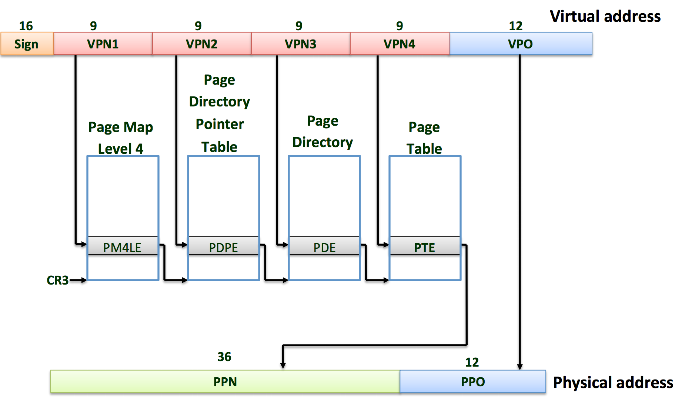

# Memory Management in osv

## Introduction
osv uses paging hardware to create virtual memory for user applications. To understand it, we start by describing the physical memory. Then we move to the address space. Finally, we describe how memory is managed in osv.

## Physical memory
A PC's physical address space is hard-wired to have the following
general layout:

	+------------------+  <- 0xFFFFFFFFFFFFFFFF (18 exabytes)
	|                  |
	|      Unused      |
	|                  |
	+------------------+  <- 0x0000000100000000 (4GB)
	|      32-bit      |
	|  memory mapped   |
	|     devices      |
	+------------------+  <- 0x00000000FE000000 (4GB - 32MB)
	|                  |
	|      Unused      |
	|                  |
	+------------------+  <- depends on amount of RAM
	|                  |
	|                  |
	| Extended Memory  |
	|                  |
	|                  |
	+------------------+  <- 0x0000000000100000 (1MB)
	|     BIOS ROM     |
	+------------------+  <- 0x00000000000F0000 (960KB)
	|  16-bit devices, |
	|  expansion ROMs  |
	+------------------+  <- 0x00000000000C0000 (768KB)
	|   VGA Display    |
	+------------------+  <- 0x00000000000A0000 (640KB)
	|                  |
	|    Low Memory    |
	|                  |
	+------------------+  <- 0x0000000000000000

The first PCs, which were based on the 16-bit Intel 8088 processor,
were only capable of addressing 1MB of physical memory. The physical
address space of an early PC would therefore start at `0x0000000000000000`
but end at `0x00000000000FFFFF` instead of `0x00000000FFFFFFFF`. The 640KB area marked
"Low Memory" was the only random-access memory (RAM) that an early
PC could use; in fact the very earliest PCs only could be configured
with 16KB, 32KB, or 64KB of RAM!

The 384KB area from `0x00000000000A0000` through `0x00000000000FFFFF` was reserved
by the hardware for special uses such as video display buffers and
firmware held in non-volatile memory. The most important part of
this reserved area is the Basic Input/Output System (BIOS), which
occupies the 64KB region from `0x00000000000F0000` through `0x00000000000FFFFF`. In
early PCs the BIOS was held in true read-only memory (ROM), but
current PCs store the BIOS in updateable flash memory. The BIOS is
responsible for performing basic system initialization such as
activating the video card and checking the amount of memory installed.
After performing this initialization, the BIOS loads the operating
system from some appropriate location such as floppy disk, hard
disk, CD-ROM, or the network, and passes control of the machine to
the operating system.

When Intel finally "broke the one megabyte barrier" with the 80286
and 80386 processors, which supported 16MB and 4GB physical address
spaces respectively, the PC architects nevertheless preserved the
original layout for the low 1MB of physical address space in order
to ensure backward compatibility with existing software. Modern PCs
therefore have a "hole" in physical memory from `0x00000000000A0000` to
`0x0000000000100000`, dividing RAM into "low" or "conventional memory" (the
first 640KB) and "extended memory" (everything else). In addition,
some space at the very top of the PC's 32-bit physical address
space, above all physical RAM, is now commonly reserved by the BIOS
for use by 32-bit PCI devices.

The detail of the memory layout may vary depending on your machine.
For example, when running on QEMU,
osv prints out the following "map" of the physical address space
(sometimes referred as the [E820 memory map](https://en.wikipedia.org/wiki/E820)):

```
E820: physical memory map [mem 0x9000-0x908f]
  [mem 0x0-0x9fbff] available
  [mem 0x9fc00-0x9ffff] reserved
  [mem 0xf0000-0xfffff] reserved
  [mem 0x100000-0xfdffff] available
  [mem 0xfe0000-0xffffff] reserved
  [mem 0xfffc0000-0xffffffff] reserved

```

It says that there are two available physical address ranges:
the first 639K and above 1MB.
The other ranges (including those _not_ mentioned in the E820 map)
are reserved by the BIOS and osv shouldn't use them.  Note that
E820 address ranges may overlap or even have holes; an address range
is safe for osv to use only if it shows up as "available" _and_ not
as "reserved."

When osv is configured for more than 4GB of physical RAM (i.e,
so RAM can extend further above `0x00000000FFFFFFFF`), the BIOS
must arrange to leave a _second_ hole in the system's RAM at the top
of the 32-bit addressable region, to leave room for these 32-bit
devices to be mapped. osv will use only the first 512MB of a PC's physical memory, so it is not an issue.

## Address space
Each process has its own illusion of having the entire memory, which is called an address space. osv uses page tables (which are implemented by hardware) to give each process its own address space. The x86_64 page table translates (or ‘‘maps’’) a virtual address
(the address that an x86 instruction manipulates) to a physical address (an address
that the processor chip sends to main memory).

### x86_64 Specific Page Tables
x86_64 uses a page table to translate virtual memory address to physical memory address. An x86_64 page table is logically an array of 2^52 page table entries (PTEs). Each PTE contains a 20-bit physical page number (PPN) and some flags. Each physical table entry controls 4096 bytes of physical memory. Such a chunk is called a page.

Address translation happens in 4 steps. A page table is stored in physical memory as a 4-level tree. The root of the page table is written in register CR3. To translate a virtual address to a physical address, paging hardware of x86_64 walks the 4-level tree to find the correct physical address. Software implementation of the page walk is `find_pte` in `arch/x86_64/kernel/mm/vpmap.c`. `find_pte` is a utility function to help osv manage the page table.



Each PTE contains flag bits that tell the paging hardware how the associated virtual address is allowed to be used. `PTE_P` indicates whether the PTE is present. `PTE_W` controls whether instructions are allowed to issue writes to the page. `PTE_U` controls whether user programs are allowed to use the page. Those flags are defined in `arch/x86_64/include/arch/mmu.h`.

osv maintains a separate page table for each process that defines that process’s address space.
As illustrated below, an address space includes the process’s user memory starting at virtual address zero.
Instructions (i.e., text) come first, followed by global variables, a heap region (for malloc), and then stack.
We call each region a memregion, each memregion has start, end, and memory permission for the region.
In osv, we cap the maximum user memory per-application at `USTACK_UPPERBOUND`. This should be plenty of memory for a user process.

	+------------------+  <- 0xFFFFFFFFFFFFFFFF (18 exabytes)
	|                  |
	|      Kernel      |
	|                  |
	+------------------+  <- KMAP_BASE = 0xFFFFFFFF80000000
	|                  |
	|      Unused      |
	|                  |
	+------------------+  <- stack memregion end (USTACK_UPPERBOUND = 0xFFFFFF7FFFFFF000)
	|                  |
	|       Stack      |
	|                  |
	+------------------+  <- stack memregion start
	|                  |
	|                  |
	|      Unused      |
	|                  |
	|                  |
	+------------------+  <- heap memregion end
	|       Heap       |
	+------------------+  <- heap memregion start / code memregion end
	|                  |
	|       Text       |
	|                  |
	+------------------+  <- code memregion start

Each process’s address space maps the kernel’s instructions and data as well as the user program’s memory. When a process invokes a system call, the system call executes
in the kernel mappings of the process’s address space. This arrangement exists so that the kernel’s system call code can directly refer to user memory. In order to leave plenty of room for user memory, osv's address spaces map the kernel at high addresses, starting at `0xFFFFFFFF80100000`.

When osv boots, `vpmap_init` (in `arch/x86_64/kernel/vpmap.c`) sets up the kernel page table. It maps virtual addresses starting at `0xFFFFFFFF80000000` (called `KMAP_BASE` in `arch/x86_64/include/arch/mmu.h`) to physical addresses starting at 0x0 as shown below. `vpmap_init` also sets up kernel text mapping, mapping all physical memory into kernel, and device memory. The kernel page table is copied into every address space in `vpmap_copy_kernel_mapping`. As each user process
gets created, code, stack and heap memregions are added to its address space.

	+---------+
	|  Kernel |
	+---------+  <- KMAP_BASE               |         |
	|  Unused |                             |         |
	+---------+  <- USTACK_UPPERBOUND       +---------+
	|   User  |                             |  Kernel |
	+---------+  <- 0                       +---------+  <- 0

	Virtual Memory                          Physical Memory


## Memory management

The kernel must allocate and free physical memory at run-time for page tables, user process memory, and kernel stacks.
osv allocates and frees physical memory at units of 4096-byte pages at a time. It uses a buddy allocator (allocates in powers of 2)
to manage physical memory allocation, more details can be found in `pmem.c`. `pmem_alloc()` allocates a page (4096 bytes) of physical memory,
`pmem_nalloc()` allocates n contiguous pages of physical memory. Each page of physical memory allocated has a corresponding `struct page` to track information about
the physical memory (how many address spaces have reference to it, size of the allocated memory and so on).

Both `pmem_alloc()` and `pmem_nalloc()` returns a *physical* memory address. To access it, you need to call `kmap_p2v()` to get the corresponding kernel virtual
address. kernel virtual address = KMAP_BASE + physical address -- all of physical memory is mapped into the kernel address space. You should use `pmem_alloc()`
or `pmem_nalloc()` to directly allocate physical memory when you need a page of physical memory (in cases like page table, user process memory, and kernel stack).

To map a page of physical memory into a process's address space, you can call `vpmap_map()` (see function protytpe in `include/kernel/vpmap.h`
and definition in `arch/x86_64/kernel/mm/vpmap.c`) with a virtual address in the user address space and the physical address returned by `pmem` allocation.

Sometimes you may want to allocate data structures (ex. `struct proc`) or buffer in kernel memory. You can use either `kmalloc()` or `kmem_cache_alloc()`
to allocate kernel memory. Both calls returns a kernel virtual address that you can access directly. `kmem_cache_alloc()` efficiently allocates memory of a
particular size defined during `kmem_cache_create()`. This should be used if you expect to allocate a particular struct multiple times (ex. `struct proc`).
`kmalloc()` is a more generic memory allocator than can handle any sized allocation <= 4096 bytes.
